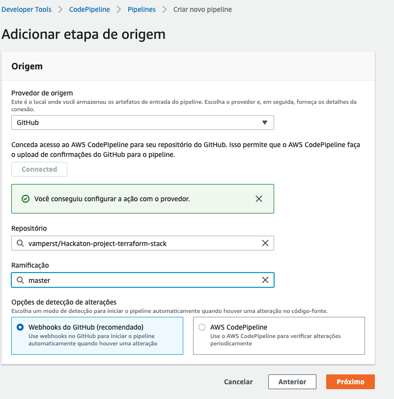
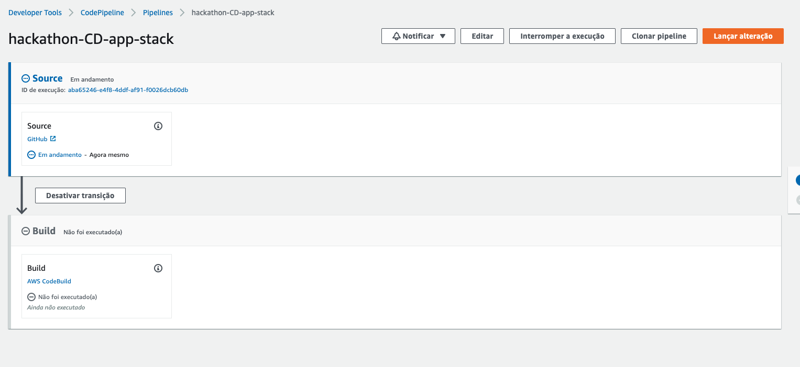
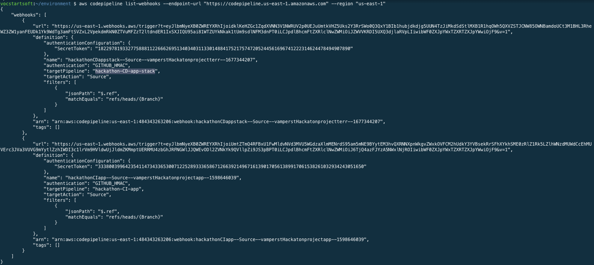
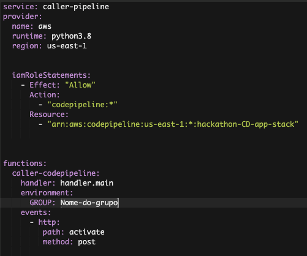
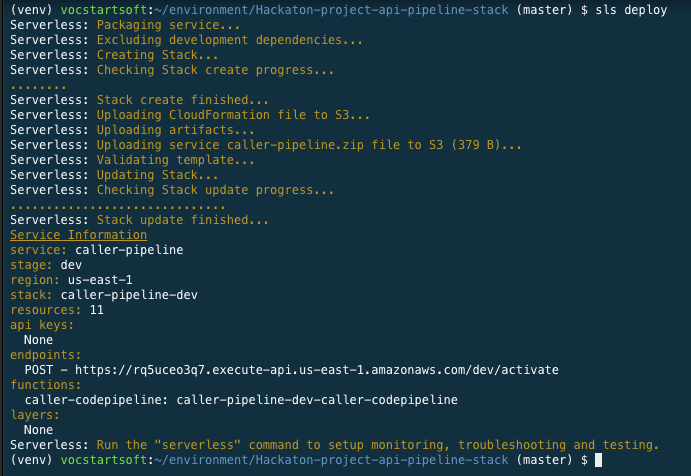
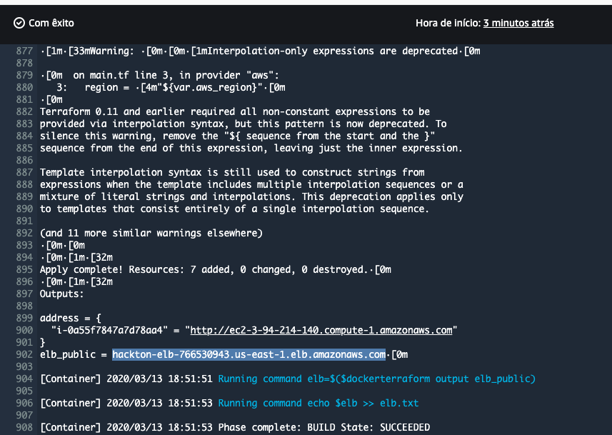

1. Vá para o console do CodePipeline e `Criar novo pipeline`
2. De o nome de 'hackathon-CD-app-stack' e clique em próximo
4. Clique em `Próximo` e escolha o githib e seu projeto `hybridnativecloud-project-terraform-stack`
   
5. Crie um COdeBuild Identico em configuração ao criado para a fase de CI e utlize o nome `hackathon-app-stack`. Adicione mais uma variavel de ambiente STAGE=prod. Clique em próximo.
   
6. Na tela implantação clique em 'Ignorar etapa implantação' e confirme.
7. Clique em 'Criar Pipeline'
8.  Assim que voltar a tela do pipeline criado rapidamente clieque em `Interromper a execução`
    
9.  Na tela que abrir deixe as opções como na imagem e clique em interromper:
    
10. Fizemos isso por 2 motivos:
    1.  Precisamos criar um Bucket onde colocaremos o que é necessário para o código executar com sucesso e alterar o arquivo Buildspec do seu repositório.
    2.  Não queremos que essa integração seja automatica por commit, então vamos desligar o webhook com o github.
11. Vamos primeiro criar o Bucket. No console da AWS vá para serviço S3. Clique em `Criar Bucket`
12. No nome do bucket crie um bucket com o seguinte padrão `hackathon-fiap-<sua turma em minusculo>-<numero do seu rm>`, ex: hackaton-fiap-1dvp-12345. Clique em criar no canto esquerdo inferior.
    
13. No IDE do cloud9 utilize o terminal para atualizar suas credenciais da aws como o setup e configuração descreve para fazer a cada 3 horas de uso.
14. No terminal execute os comandos substituindo o bucket pelo o que acabou de criar:
    ```
    aws s3 cp ~/.aws/config s3://hackathon-fiap-<sua turma em minusculo>-<numero do seu rm>/instance-need/.aws/config
    aws s3 cp ~/.aws/credentials s3://hackathon-fiap-<sua turma em minusculo>-<numero do seu rm>/instance-need/.aws/credentials
    aws s3 cp ~/.ssh/fiap-lab.pem s3://hackathon-fiap-<sua turma em minusculo>-<numero do seu rm>/instance-need/.ssh/fiap-lab.pem
    ```
15. No IDE navegue até o arquivo `hybridnativecloud-project-terraform-stack/buildspec.yml` e abra.
16. Altere todos os s3:// do arquivo para colocar o nome do bucket criado por você.
    
17. Agora vá até o arquivo `hybridnativecloud-project-terraform-stack/state.tf` e tambem altere o nome do bucket.
18. Precisamos fazer o commit dessas alterações mas para que o webhook do pipeline não seja acionado vamos desabilitar ele.
19. Execute o comando `aws codepipeline list-webhooks --endpoint-url "https://codepipeline.us-east-1.amazonaws.com" --region "us-east-1"` no terminal e localize o targetPipeline com o nome do pipeline recem criado.
    
20. Copie o name do WebHook
    
21. Execute o comando `aws codepipeline deregister-webhook-with-third-party --webhook-name <webhook-name> --region=us-east-1` colando o nome do webhook que copiou no lugar de '< webhook-name >". Isso irá desativar o webhook e o pipeline não será executado cada vez que você fizer commit no seu repositório.
22. Agora vamos subir a api que irá ser a responsável por ativar o pipeline cada vez que for chamada. Mas antes precisamos criar um virtual env para o python. Para isso execute os comandos a seguir no terminal do cloud9, ao final verá que o inicio da linha do terminal tem  escrição `(venv)`:
    ```
    python3 -m pip install --user virtualenv
    python3 -m venv ~/venv
    source ~/venv/bin/activate
    ```
    
23. Vamos utilizar serverless framework para subir a infraestrutura. Via terminal vá para a pasta do projeto com o comando `cd ~/environment/hybridnativecloud-project-api-pipeline-stack/`
24. No IDE vá até o arquivo hybridnativecloud-project-api-pipeline-stack/serverless.yml e altere a variavel GROUP colocando o nome do seu grupo.
    
25. De volta ao terminal execute o comando `sls deploy`.
    
26. Execute o comando `curl -X POST URL-POST-OUTPUT-SERVERLESS | jq` para iniciar o pipeline.
    
27. Você pode verificar a execução do pipeline e do codebuild pelo painel do CodePipeline e detalhes.
28. É sempre bom lebrar que a stack precisa dos modulos de VPC e RT dos exercicios de terraform para funcionar.
29. Ao final da execução você consegue pegar o link do ELB criado no final do log do codebuild ou no painel ec2/elastic clod balancers. Não esqueça que demora alguns minutos para a instancia se registrar no ELB:
    
    
30. Para performar o destroy volte ao terminal do Cloud9
31. Entre na pasta do projeto de terraform `cd ~/environment/hybridnativecloud-project-terraform-stack/`
32. Verifique se o bucket do arquivo state.tf esta com o valor correto do nome que você criou.
33. Execute o comando `terraform init` no terminal
34. Execute o comando `terraform workspace list` para ver que agora temos um workpace criado pelo pipeline chamado 'Prod'
    
35. Execute o comando `terraform workspace select Prod` para mudar para a workspace desejada.
36. Execute o comando `terraform destroy -auto-approve` e ao perguntar o endereço od registry cole a URL do ECR criado.
    
37. Faça quantos testes achar necessário. Você pode alterar o count do main para subir mais EC2 no ELB. Lembre-se sempre de commitar as alterações no seu repositório. Não no do professor. 
